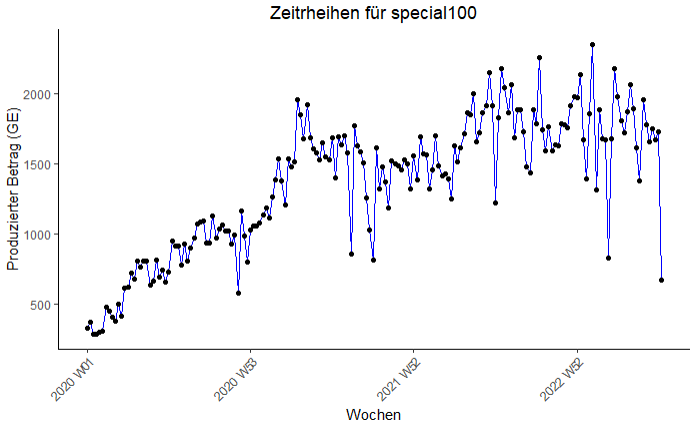
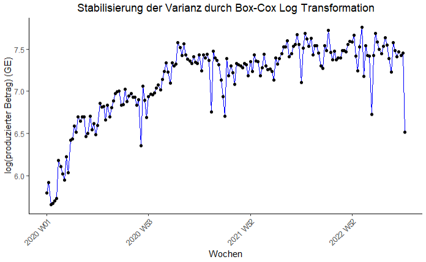

# Zeitrheihen Forecasting mit Autoregressive Integrated Moving Average (ARIMA)

**ACHTUNG!**: Ausführliche Erklärungen zum Vorgehen oder Methode der Analyse sind in *time_series_analysis.pdf* erfasst.

In diesem Komponent meines Systems werden statistische Methode eingesetzt, um Forecasting für das Produkt, dass am Meisten produziert wurde.Das Ergebnis des Forecasts soll den Geschäftführer der paderborner fiktiven Bäkerei dienen, eine datenbasierte Entscheidung zu treffen, ob er seine Bäkerei wieder öffnen soll oder nicht.Laut der Geschäftsführer soll die Analyse an Hand des produzierten Beträge erfolgen. Die Analyse efolgt mit der programmiersprache R.

**Produkte mit produzierte Beträge in GE**

**Die Drei meist produzierte Produkte**

**Betrachte man die Graphik für das meist produzierte Produkt sprich special100_amt, dann kann man folgendes beobachten**

+ Die Zeitrheihe zeigt allgemein einen steigenden Trend von 2020 bis Mitte 2023, obwohl der Trend ab Ende 2022 gesunken ist.
+ Die Beobachtungen der Zeitrheihen weisen ein gewisses Maß an Züfälligkeit auf.
+ Die Variation ist über die ganze Zeit ziemlich konstant bzw. gleich.
+ Die Anzahl an Tief Punkte steigt über die Jahre. Diese könnte wegen steigende Markt Konkurenz gewesen.
+ Es gibt keine Woche ohne Beobachtung.

**Das Korrelogram Beobachten**

**Beobachtungen aus dem Korrelogram**
- Für lag = 0 ist der Korrelation Koeffizient (ACF) gleich eins. D.h Die Zeitrheihe ist noch nicht verschoben. Somit ist die Korrelation am Stärksten.
- Die ACFs sind durchaus positive und sinken mit steigenden lags. Diese zeigt das existierenden Trend in der Zeitrheihe.
- Mehr als 5% der ACFs liegen außerhalb dem Signifikanten Bereich. D.h es liegen Korrelationen in der Zeitrheihe und somit ist die Zeitrheihe kein *White Noise* Prozess. Dies ist ein weiteres Hinweis, dass die Zeitrheihe *nicht Stationär* ist.

**Die Transformation mit Box-Cox**

**Beobachtungen aus der log transformierte Zeitrheihe**

+ Nach der Log Transformation ist die Varianz der Zeitrheihe über die Zeit Konstant.
+ Es besteht immernoch einen Trend. Der Trend kann durch *Differenzierung erster Ordnung* stabilisiert werden.Differenzierung ist allerdings nicht wichtig, weil der Forecast mit ARIMA durchgeführt wird. 

**Forecast mit ARIMA(0,1,1)**

*Interpretation des Forecastsbereichs*
+ Die blaue Linie steht für den Mittelwert Forecasts (Point Forecasts) und zeigt die durchschnittliche Erwartungswerte in der Zukunft.
+ Die Dünne blaue Linie zeigt wie der Mittelwert sich im Laufe der Zeit entwickelt wird.
+ 80% Confident Interval: Mit 80% Wahrscheinlichkeit wird einen Wert in dem Bereich vorhergesagt.
+ 95% Confident Interval: Mit 95% Wahrscheinlichkeit wird einen Wert in dem Bereich vorhergesagt.

**Simulation für ARIMA(0,1,1)**

Hier sind 5 mögliche Pfade, die durch die Prognose entstehen könnten. 

**Forecast mit Benchmark Modellen**

Das seasonal_naive Modell hat verleichbar einen besseren Forecast unter der Benchmark Modellen erzielt. Um die Genauigkeit des ARIMA(0,1,1) im Laufe der Zeit zu messen, kann für die diese Zeitrheihe die Forecast Werte aus ARIMA(0,1,1) mit der Forecast Werte aus seasonal_naive verglichen.Es ist durchaus möglich die beiden Modellen in der Produktion einzusetzen.

**Schüssfolgerungen aus der Anaylse**
+ Die Forecast zeigt, dass das Produkt *Special100* weiterhin ein starkes Präsenz am Markt gehabt hätte.
+ Mit einer guten Investition und Datengestützte Strategie kann *Local Bakery* den Markt wieder eintreten.
+ Dadurch wird *das paderborner Lokal Bakery* seine Kunden wieder gewinnen, denn die Aussichten dieses Produkts zeigen Potenzial.
+ Neben das Produkt *special100* kann den Fokus auch auf *local300* und *special500* gelegt werden.

