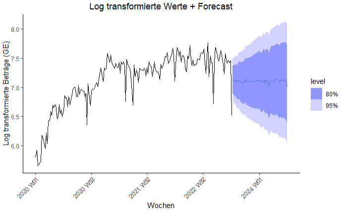

# Zeitrheihen Forecasting

**ACHTUNG!**: Ausführliche Erklärungen zum Vorgehen oder Methode der Analyse sind in *time_series_analysis.pdf* erfasst.

In diesem Komponent meines Systems werden statistische Methode eingesetzt, um Forecasting für das Produkt, dass am Meisten produziert wurde.
Die Analyse efolgt mit der programmiersprache R.

**Betrachte man die Graphik für das meist produzierte Produkt sprich special100_amt, dann kann man folgendes beobachten**

+ Die Zeitrheihe zeigt allgemein einen steigenden Trend von 2020 bis Mitte 2023, obwohl der Trend ab Ende 2022 gesunken ist.
+ Die Beobachtungen der Zeitrheihen weisen ein gewisses Maß an Züfälligkeit auf.
+ Die Variation ist über die ganze Zeit ziemlich konstant bzw. gleich.
+ Die Anzahl an Tief Punkte steigt über die Jahre. Diese könnte wegen steigende Markt Konkurenz gewesen.
+ Es gibt keine Woche ohne Beobachtung.

**Das Korrelogram Beobachten**

**Beobachtungen aus dem Korrelogram**
- Für lag = 0 ist der Korrelation Koeffizient (ACF) gleich eins. D.h Die Zeitrheihe ist noch nicht verschoben. Somit ist die Korrelation am Stärksten.
- Die ACFs sind durchaus positive und sinken mit steigenden lags. Diese zeigt das existierenden Trend in der Zeitrheihe.
- Mehr als 5% den Werten liegen außerhalb dem Signifikant Bereich. D.h es liegen Korrelationen in der Zeitrheie und somit ist die Zeitrheihe kein *White Noise* Prozess. Dies ist ein weitere Hinweis, dass die Zeitrheihe *nicht Stationär* ist.

**Die Transformation mit Box-Cox**

**Beobachtungen aus der log transformierte Zeitrheihe**

+ Nach der Log Transformation ist die Varianz der Zeitrheihe über die Zeit Konstant.
+ Es besteht immernoch einen Trend

**Forecast mit ARIMA**

**Forecast mit Benchmark Modellen**

